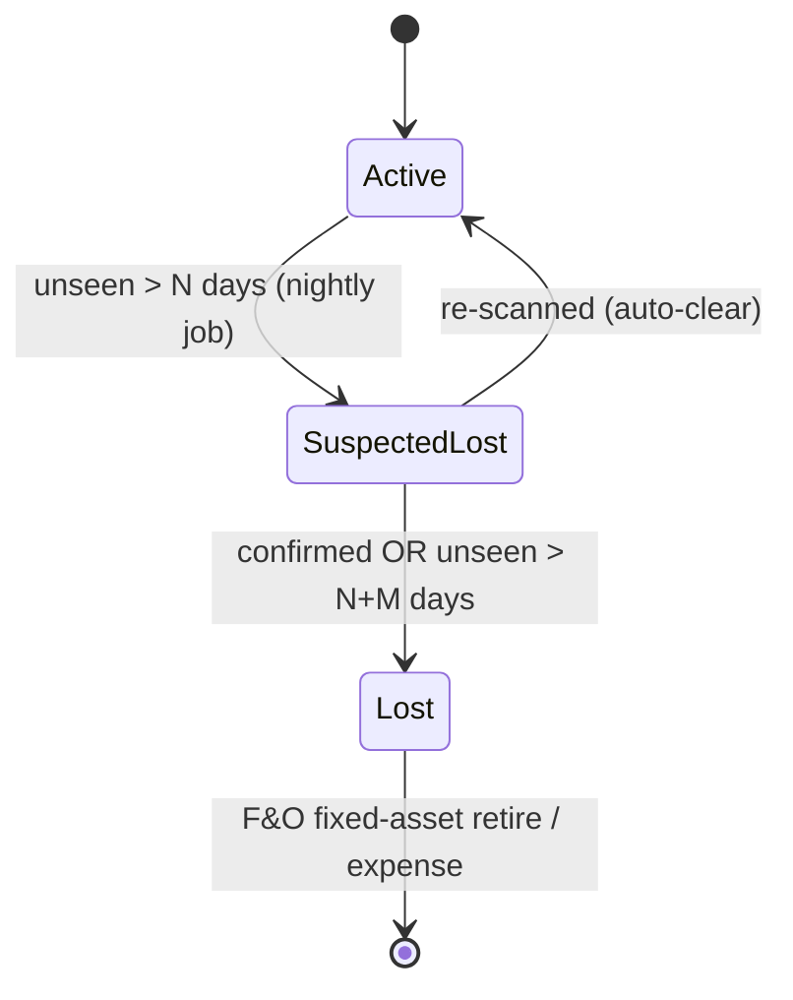

# Tray Write-Off Flow

Lifecycle from "seen recently" to a financial write-off.

## Stages

1. **SuspectedLost** — `asset.usp_ComputeNightlyMetrics` raises a `SuspectedLost` exception when a tray's `LastSeenUtc` is older than **N days** (default 21). Non-destructive; if the tray is scanned again the exception auto-clears (a new custody/scan updates `LastSeenUtc`).
2. **Confirmed Lost** — after a further **M days** unseen (or a manager confirms in the ops console), tray `TrayStatus → Lost`.
3. **Write-off (optional)** — on confirmation, an optional hook posts to D365:
   - **Fixed asset** trays → fixed-asset **retirement/disposal**.
   - **Expensed** trays → an inventory **write-off / expense** journal.
   The hook reuses the Module 9 `ID365Client` posting pattern (idempotent, retry, dead-letter).

## Config

| Setting | Default | Meaning |
|---------|---------|---------|
| `UnseenLostDays` (N) | 21 | Days unseen → SuspectedLost |
| `ConfirmLostDays` (M) | 30 | Further days → confirmed Lost |
| `WriteOffMode` | `None` | `None` \| `FixedAsset` \| `Expense` |

## Audit

Every stage transition is an event/exception with user + timestamp; the tray's custody chain plus these transitions give a full audit trail for finance.
