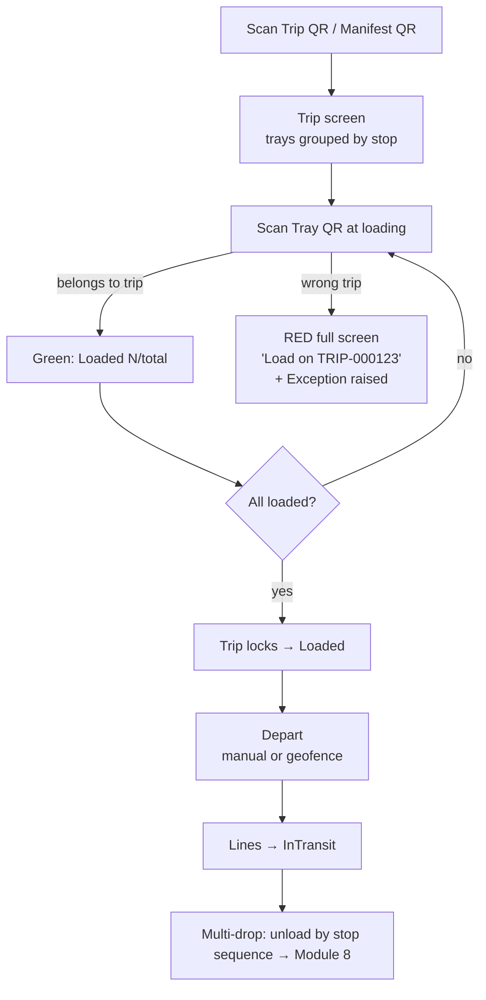

# Driver App — Module 7 (Vehicle Loading & Trip Management)

A **.NET MAUI** mobile app for drivers: open a trip, load trays with wrong-trip protection, lock the trip, and depart. The same app framework handles **store receiving (Module 8)**.

## Why .NET MAUI (not Power Apps)

| Requirement | MAUI | Power Apps canvas |
|-------------|------|-------------------|
| **Deep offline** in low-connectivity vans/loading bays | ✅ Native local SQLite queue, full control of sync | ⚠️ Offline is limited & fiddly for complex write flows |
| **Background geofence** departure detection | ✅ Platform geofencing APIs (CLLocationManager / Geofencing) | ❌ No true background location |
| **Hardware imager / rugged scanners** | ✅ Direct SDK + camera (ZXing.Net.MAUI) | ⚠️ Camera only; imager integration weaker |
| **Signature + photo capture** (POD in M8) | ✅ Native drawing surface + camera | ✅ OK but heavier |
| Speed to build / low-code | ⚠️ More code | ✅ Fastest |

The pick app (M3) stays in Power Apps — it lives inside the warehouse on Wi-Fi and benefits from low-code speed. The **driver/receiving** apps run in the field where offline, background location, and rugged hardware matter, so MAUI is the right trade. One MAUI codebase covers both M7 and M8, sharing `TrackingApiClient` and the local queue.

## Screen flow



### 1. Open trip
Driver scans the **trip manifest QR** (`MANIFEST-TRIP-000123`). App calls `GET /trips/{tripNumber}` and renders trays grouped by stop in unload order.

### 2. Load trays
Each tray scan → `POST /trips/{tripNumber}/load`. The **server** owns wrong-trip truth:
- **Belongs to trip** → green tick, running `loaded / total`.
- **Wrong trip** → immediate **red full-screen** showing the correct trip number (from `correctTripNumber`); a `WrongTrip` exception is raised server-side. Tray is *not* loaded.
- **Already loaded** / **trip locked** → informational.

### 3. Complete & lock
When the last planned tray is loaded, the response carries `tripNowLocked: true`; all tray order lines transition **Staged → Loaded** and the trip locks against further loading.

### 4. Departure
Either the driver taps **Depart**, or the telematics geofence fires `POST /events/telemetry {event:"depart"}`. Loaded lines transition **Loaded → InTransit**.

### 5. Multi-drop
Trays are grouped by `stopSequence`. The app enforces unload order at each stop and does per-store validation at receiving (Module 8).

## API surface used (Module 6/7 backend)

| Call | Purpose |
|------|---------|
| `POST /trips` | Dispatcher creates a trip (see below) |
| `GET /trips/{tripNumber}` | Load trip + grouped trays |
| `POST /trips/{tripNumber}/load` | Tray load scan (wrong-trip detection) |
| `POST /events/telemetry` | Geofence depart/arrive |

### Trip creation (dispatcher)
```json
POST /trips
{
  "vehicleReg": "AB12 CDE",
  "driverName": "J. Rider",
  "routeCode": "R-NORTH",
  "stops": [ { "sequence": 1, "storeCode": "S-101" }, { "sequence": 2, "storeCode": "S-102" } ],
  "plannedTrays": [
    { "trayQr": "TRAY-LDN1-000001", "stopSequence": 1, "orderLineIds": [1001, 1002] },
    { "trayQr": "TRAY-LDN1-000002", "stopSequence": 2, "orderLineIds": [1003] }
  ]
}
→ { "tripNumber": "TRIP-000001", "manifestQr": "MANIFEST-TRIP-000001", "status": "Planned", "stops": 2, "trays": 2 }
```

## Geofence webhook contract

See [`geofence-webhook.md`](geofence-webhook.md).

## Source

`src/` contains the key MAUI code: `TrackingApiClient`, models, and the loading page + view-model with ZXing scanning. Build requires the MAUI workload:

```bash
dotnet workload install maui
dotnet build src/TrackNTrash.DriverApp.csproj
```
