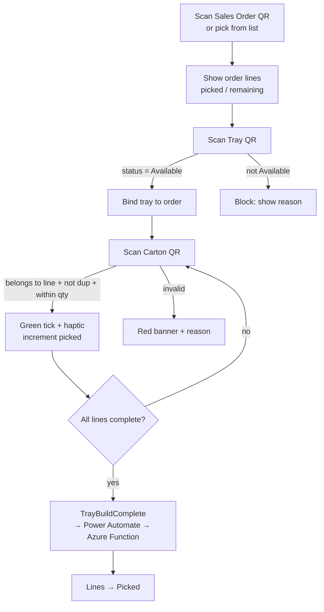

# Pick & Tray Build App — Module 3

A **Power Apps canvas app** (phone layout) for warehouse pickers. It reconciles physical cartons against the sales order as they are scanned into a reusable tray, then emits a `TrayBuildComplete` event that advances the affected shipment lines to **Picked**.

This is Checkpoint 1 in the flow.

## Deliverables in this folder

| File | Contents |
|------|----------|
| `dataverse-schema.md` | Dataverse tables + columns the app reads/writes |
| `screens-and-formulas.md` | Screen-by-screen build with Power Fx formulas |
| `power-automate/TrayBuildComplete.md` | Flow spec + `flow-definition.json` skeleton |
| `offline-and-conflicts.md` | Offline queue + multi-device conflict handling |

## Flow (happy path)

## Validation rules at carton scan

1. **Belongs to order line** — decoded GTIN maps to an open line on this order.
2. **Not already scanned** — carton serial not already in the local scanned set (or server-confirmed).
3. **Quantity not exceeded** — picked count for the line < expected carton count.

Success → green tick + `Notify` + device haptic. Failure → red banner naming the exact reason.

## Integration boundary

The app does **not** write to Azure SQL directly. On completion it calls a Power Automate flow with the full carton list; the flow calls the Module 6 Azure Function `POST /events/scan` (event type `TrayBuildComplete`), which writes the append-only `ScanEvent` rows and runs the state machine. This keeps the device offline-tolerant and the write path idempotent on `(deviceId, clientEventId)`.
