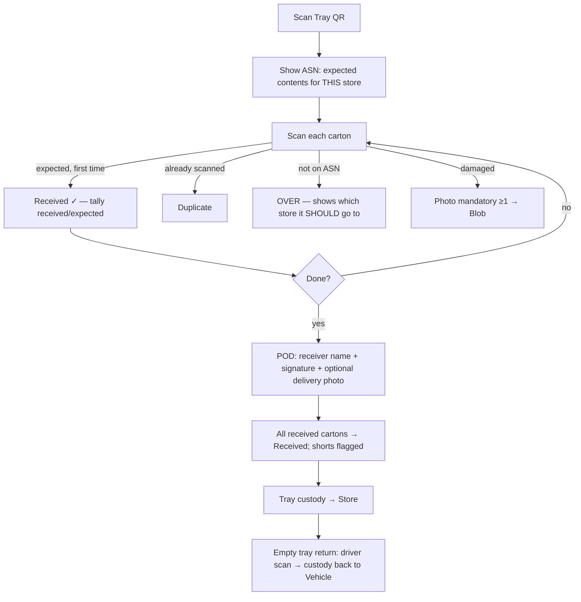

# Store Receiving — Module 8

Store-staff **.NET MAUI** flow (same framework/app family as the driver app, M7) to receive a tray against its ASN, reconcile carton-by-carton, capture POD, and transfer tray custody. Empty trays are returned to the vehicle.

This is Checkpoint 4.

## Screen flow

## Reconciliation (server-verified, `ReceivingService`)

Running tally **received / expected / unexpected**. Each carton scan classifies:

| Outcome | Trigger | UI |
|---------|---------|-----|
| **Received** | On the ASN, first scan | green tick, tally++ |
| **Duplicate** | On the ASN, already scanned | amber note |
| **Over** | Not on the ASN | red; shows `correctStoreCode` (which store it belongs to) |
| **Short** | On the ASN, never scanned (computed at completion) | listed in summary |
| **Damaged** | Staff flags a received carton | **photo mandatory (≥1)** → Blob |

## Completion & POD

On complete the app posts:
- **Receiver name** (required), **signature** (drawing surface → PNG → Blob), optional **delivery photo**.
- Server emits a `ReceivingComplete` event per order line (`RECEIVED` or `SHORT` verdict) → lines transition **InTransit → Received**; shorts raise exceptions.
- Tray custody transfers to the store (`TrayCustodyTransfer`).

## Empty tray return

Driver scans returning trays → `POST /receiving/return-tray` → custody moves **Store → Vehicle** (`EmptyTrayReturn`); a warehouse return scan later moves it back to Warehouse (closing the loop, feeding Module 10 asset analytics).

## Events emitted

| Event | When | Effect |
|-------|------|--------|
| `ReceivingComplete` (per line) | Completion | Line → Received (or Short exception) |
| `TrayCustodyTransfer` | Completion | Tray custody → Store |
| `EmptyTrayReturn` | Driver return scan | Tray custody → Vehicle |

`ReceivingComplete` is consumed by the D365 integration (Module 9) to post the delivery note / packing slip confirmation.

## API surface used

| Call | Purpose |
|------|---------|
| `PUT /asn` | Seed the ASN (trip planning / D365) |
| `POST /receiving/start` | Open a session, get expected contents |
| `POST /receiving/{id}/scan` | Reconcile a carton |
| `POST /receiving/{id}/damaged` | Flag damage (photo required) |
| `POST /receiving/{id}/complete` | POD + finalize |
| `POST /receiving/return-tray` | Empty tray return |

## Storage design

Photos & signatures → Azure Blob Storage; see [`pod-and-storage.md`](pod-and-storage.md).

## Source

`src/` — `ReceivingApiClient` and `ReceivingViewModel` (reconciliation UI logic). Signature capture uses a MAUI `GraphicsView` drawing surface; photos via `MediaPicker.CapturePhotoAsync`. Build needs the MAUI workload (`dotnet workload install maui`).
