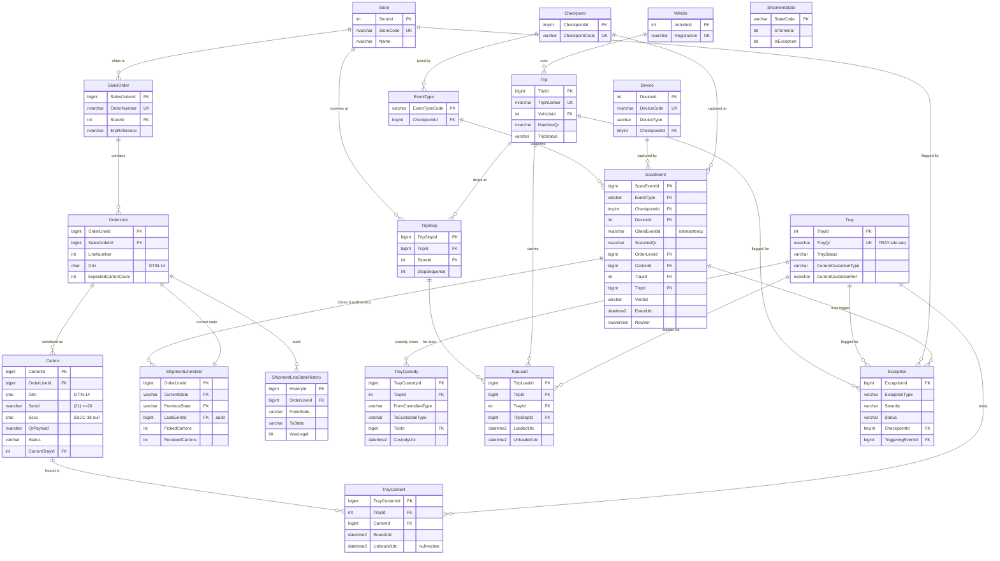

# TrackNTrash — Entity-Relationship Diagram (Module 1)

## Key modeling notes

- **`ScanEvent` is append-only** — enforced by `ops.TR_ScanEvent_NoMutate` (INSTEAD OF UPDATE/DELETE → THROW). It is the immutable source of truth; everything else is master data or a derived projection.
- **`ShipmentLineState`** is a 1:1 projection per `OrderLine`, carrying `LastEventId` so any state can be traced back to the event that set it. `ShipmentLineStateHistory` keeps the full transition trail, including illegal transitions (`WasLegal = 0`).
- **Custody chain** — `TrayCustody` appends one row per movement (from/to custodian type+ref, optional trip and event refs). Current custodian is the latest row (`ops.vTrayCurrentCustody`) and is also denormalized onto `Tray` for fast reads.
- **Active-binding uniqueness** — filtered unique indexes guarantee a carton is bound to ≤1 tray at a time (`UX_TrayContent_ActiveCarton`) and a tray is loaded on ≤1 trip at a time (`UX_TripLoad_ActiveTray`).
- **GS1 identity** — `Gtin CHAR(14)` (digits-only check), `Serial NVARCHAR(20)` (alphanumeric, ≤20), `Sscc CHAR(18)` (18 digits, filtered-unique when present).
- **Idempotency** — `UQ_ScanEvent_Idem (DeviceId, ClientEventId)` lets offline replay / retries land exactly once.
