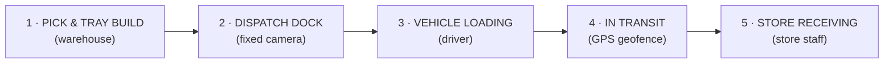
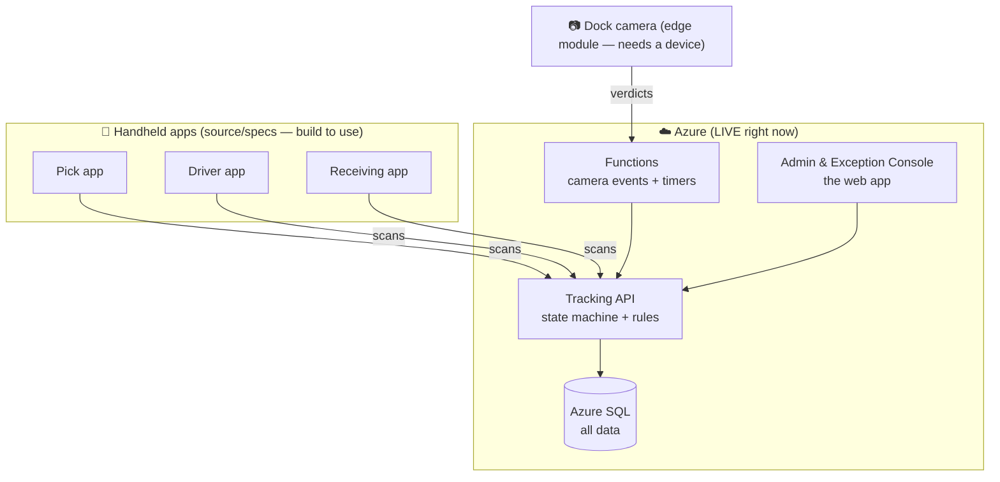

# TrackNTrash — Functional Guide (plain-language)

This explains **what the system does, who uses what, and where every piece lives** — without the jargon.

---

## 1. What is TrackNTrash?

It makes sure the **right items reach the right store**, and tracks the **reusable trays** so they don't get lost.

Every time someone scans a QR code (or a camera reads one), the system records an **event** that can never be edited or deleted. From those events it always knows exactly where each carton and tray is, and it raises an **exception** the moment something doesn't add up (a missing carton, a tray on the wrong truck, a short delivery).

---

## 2. The journey of an order (the 5 checkpoints)

| # | Checkpoint | Who | What happens | Device |
|---|-----------|-----|--------------|--------|
| 1 | **Pick & Tray Build** | Warehouse picker | Scans the order, scans a tray, scans each carton into it | **Handheld phone** (Pick app) |
| 2 | **Dispatch Dock** | (automatic) | Overhead **camera** reads the tray + carton QRs and counts the boxes — flags mismatches | **Fixed camera** (no person) |
| 3 | **Vehicle Loading** | Driver | Scans each tray onto the truck; wrong tray → red screen | **Handheld phone** (Driver app) |
| 4 | **In Transit** | (automatic) | Truck crosses a GPS boundary → marked "on the road" | **Telematics / phone GPS** |
| 5 | **Store Receiving** | Store staff | Scans each carton against the expected list; captures a signature/photo | **Handheld phone** (Receiving app) |

A shipment line moves through states in order: **Ordered → Picked → Staged → Loaded → In Transit → Received**. If a scan tries to skip a step, the event is still recorded but an **exception** is raised.

---

## 3. ⭐ Where is the "mobile app for scanning"? (the common question)

**There isn't one single app — there are three handheld apps, one per role, and they are NOT web pages you open in a browser.** They run on phones/handheld scanners. Here's exactly what each is and where it lives in the repo:

| App | Used at | Built with | Where it lives | How you'd run it |
|-----|---------|-----------|----------------|------------------|
| **Pick app** | Warehouse (checkpoint 1) | **Power Apps** (low-code) | `apps/pick-app/` — screen specs, formulas, the automation flow | A maker imports it into **Power Apps Studio**, then it runs inside the **Power Apps mobile app** on a phone |
| **Driver app** | Truck loading (checkpoint 3) | **.NET MAUI** (native mobile) | `apps/driver-app/src/` — full source code | Build with the MAUI toolkit → install the **Android/iOS app** on the driver's phone |
| **Receiving app** | Store (checkpoint 5) | **.NET MAUI** (native mobile) | `apps/receiving-app/src/` — full source code | Same — build → install on the store's phone |

> **Important:** these three apps are delivered as **source code and specifications**, not as running apps. To use them for real you need to (a) build/import them and (b) install them on physical devices with cameras. That's normal for warehouse systems — the scanning apps are always native mobile, not websites.

### So how do I *see* the scanning flow right now?

Use the **Admin Console** (the web app that IS deployed and running). Its **Orders** and **Trips** screens have buttons that **simulate each scan**, so you can watch an order travel through all 5 checkpoints in your browser — no phone needed. See section 5.

---

## 4. What runs where (the whole system)

| Piece | Status | What it is |
|-------|--------|-----------|
| **Tracking API** | 🟢 Live on Azure | The brain: records events, runs the state machine, raises exceptions |
| **Azure SQL** | 🟢 Live on Azure | Stores everything (orders, cartons, trays, events, exceptions) |
| **Functions** | 🟢 Live on Azure | Processes dock-camera events + runs periodic checks |
| **Admin & Exception Console** | 🟢 Live on Azure | The **web app** with menus — your window into the system |
| **Pick / Driver / Receiving apps** | 📦 Source/specs | Handheld apps — build & install to use |
| **Dock camera module** | 📦 Source | Runs on an IoT Edge device wired to a camera |
| **Power BI dashboards** | 📦 Design | Star-schema + report specs, ready to build in Power BI |

---

## 5. How to use it right now (in your browser)

Open the **Admin & Exception Console** (live):
**https://stz3yo3xfwp433mdev.z29.web.core.windows.net**

The left **menu** has:

- **Dashboard** — health, open exceptions, severity breakdown, recent activity.
- **Orders** — *this is where you can watch the whole flow:*
  1. Click **Create order** (creates real data in Azure SQL).
  2. Click the checkpoint buttons in order: **Pick → Dock PASS → Load → Depart → Receive**. Watch the line's state change each time.
  3. Or click **Force dock COUNT_MISMATCH** / **Illegal (out-of-order receive)** to raise an exception on purpose.
- **Trips & Loading** — create a trip, "scan" a tray to load it, try a tray that isn't on the trip to see the **wrong-trip rejection**, then **Depart**.
- **Manifests (ASN)** — set the expected contents of a tray (what the dock camera and receiving check against).
- **Line Lookup** — type an order-line number to see its current state on a progress stepper.
- **Exceptions** — the live monitor. New exceptions appear instantly (the **● live** dot top-left confirms the real-time link). Click one to see the camera frame/photo, the full event timeline, and to **Acknowledge / Resolve / Escalate** it (every action is logged).

> The **Orders** and **Trips** buttons are standing in for what the warehouse picker, driver, and store staff would do on their handheld apps. Same events, same API, same Azure SQL — just driven from the browser so you can see it work end to end.

---

## 6. Who does what (roles)

| Role | Where | Their app |
|------|-------|-----------|
| **Warehouse picker** | Warehouse | Pick app (handheld) |
| **Driver** | On the road | Driver app (handheld) |
| **Store staff** | Store | Receiving app (handheld) |
| **Dispatcher / Warehouse manager** | Office | **Admin & Exception Console** (web) — monitors exceptions, manages trips/orders |
| **Store manager** | Store back-office | Power BI dashboards (their store only) |

In the console, the top-left user chip shows the signed-in person and their role (Dispatcher / Warehouse Manager / Admin). Roles control who can Resolve or Escalate exceptions.

---

## 7. Quick reference — live links

| Thing | Link |
|-------|------|
| **Admin & Exception Console** (start here) | https://stz3yo3xfwp433mdev.z29.web.core.windows.net |
| Tracking API (health check) | https://app-tracking-tracktrash-dev-z3yo3x.azurewebsites.net/health |
| API docs (Swagger) | https://app-tracking-tracktrash-dev-z3yo3x.azurewebsites.net/swagger |

---

## 8. In one paragraph

Scanning happens on **three handheld apps** (warehouse pick, driver load, store receive) — those are native mobile apps you build and install, not websites. A **fixed camera** double-checks at the dock. Everything they scan flows into a **cloud brain** (the Tracking API + Azure SQL) that tracks each order through five checkpoints and raises **exceptions** when something's wrong. You watch and manage all of it from the **web console** — and, since the handheld apps aren't installed yet, that same console lets you **simulate the scans** so you can see the whole journey working today.
