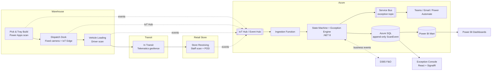
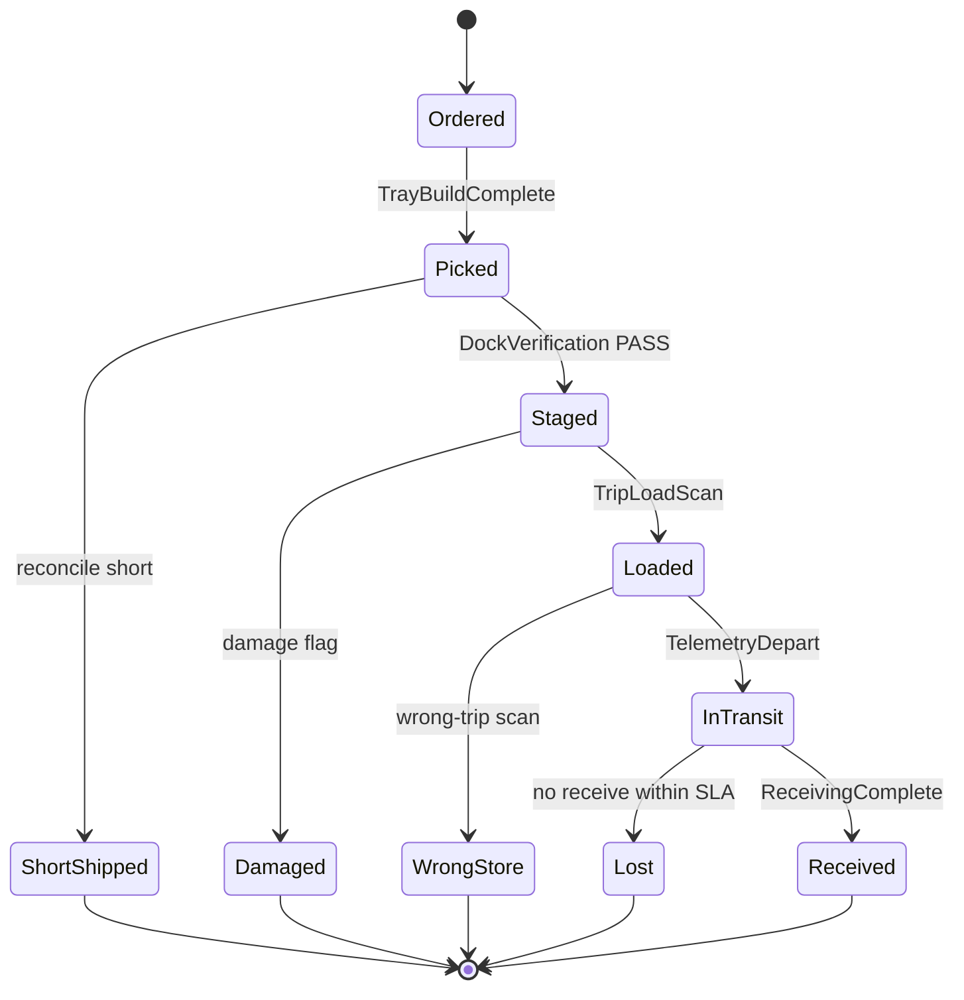

# Architecture Overview

## 1. End-to-end flow

## 2. State machine

**Rule:** an event that implies an illegal transition (e.g. `Loaded` while still `Ordered`) is **always written** to `ScanEvent`; the state machine then raises an `Exception` record instead of advancing state. Events are the source of truth; `ShipmentLineState` is a derived projection with a `LastEventId` FK for audit.

## 3. Event idempotency

Every write-producing scan carries `(deviceId, clientEventId)`. Ingestion dedupes on this pair so offline replay / retries never double-count. `ScanEvent` is append-only (no UPDATE/DELETE), with a `rowversion` column for optimistic concurrency on projections.

## 4. Component responsibilities

| Layer | Component | Module | Responsibility |
|-------|-----------|--------|----------------|
| Data | Azure SQL schema | M1 | Orders, cartons, trays, trips, events, state, exceptions |
| Service | Label API | M2 | GS1 QR + SSCC generation, ZPL/SVG output |
| App | Pick app | M3 | Tray build reconciliation, offline queue |
| Edge | Vision module | M4 | Dock multi-QR decode + carton count verdict |
| ML | YOLO pipeline | M5 | Carton detection model + export/benchmark |
| Service | Tracking API | M6 | Ingest, state machine, exception rules, notifications |
| App | Driver app | M7 | Trip load validation, multi-drop |
| App | Receiving app | M8 | ASN reconcile, POD, tray custody transfer |
| Integration | D365 F&O | M9 | SO/work in, picking/ASN/delivery out |
| Analytics | Asset registry | M10 | Custody chain, dwell, loss, fleet sizing |
| Analytics | Power BI | M11 | Star schema, DAX, dashboards, RLS |
| Web | Exception console | M12 | Ops triage, live updates, audit |
| Ops | IaC + runbook | M13 | Bicep, CI/CD, commissioning |

## 5. Trust & security posture

- Handheld auth via Entra ID; console roles: Dispatcher / Warehouse Manager / Admin.
- Store-manager RLS in Power BI (own store only).
- Blob lifecycle: exception frames/photos 1 year, PASS samples 30 days.
- Secrets in Key Vault; no credentials in code or config committed to the repo.
