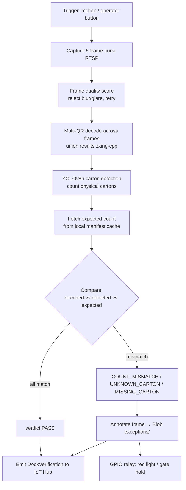

# Dock Vision Module — Module 4

Azure IoT Edge module for the **dispatch-dock verification camera**. On trigger it captures a burst, decodes every QR (1 tray + N cartons), counts physical cartons with YOLOv8, compares against the tray manifest, and emits a `DockVerification` verdict. Non-PASS verdicts save an annotated frame, upload it to Blob, and pulse a GPIO relay (red light / gate hold).

This is Checkpoint 2.

## Pipeline



## Verdict logic

Let `decoded` = # carton QRs decoded, `detected` = # cartons YOLO counted, `expected` = manifest count.

| Condition | Verdict |
|-----------|---------|
| `decoded == detected == expected` | `PASS` |
| `detected > decoded` (a box with no readable QR) | `UNKNOWN_CARTON` |
| `decoded < expected` or `detected < expected` | `MISSING_CARTON` |
| otherwise counts disagree | `COUNT_MISMATCH` |

## Resilience

- **Glare/blur** — per-frame Laplacian-variance quality score; low-quality frames dropped, burst retried up to N times.
- **Occlusion** — multi-frame **union** of decoded QRs (a code hidden in one frame may be visible in another).
- **Offline** — IoT Edge store-and-forward buffers `DockVerification` messages until IoT Hub is reachable.

## Config (module twin desired properties)

```json
{
  "cameraRtspUrl": "rtsp://dock-cam.local/stream1",
  "burstFrames": 5,
  "qualityThreshold": 100.0,
  "maxBurstRetries": 3,
  "manifestSyncUrl": "https://tracktrash-tracking.azurewebsites.net/manifests",
  "blobExceptionContainer": "exceptions",
  "gpioRelayPin": 17,
  "triggerMode": "motion"
}
```

## Files

| File | Role |
|------|------|
| `app/main.py` | Module host: IoT Hub client, twin, trigger loop |
| `app/pipeline.py` | Capture → quality → decode → detect → verdict |
| `app/qr_decode.py` | Multi-frame QR union (zxing-cpp / pyzbar fallback) |
| `app/detector.py` | YOLOv8 ONNX carton counter |
| `app/manifest_cache.py` | Local manifest delta-sync + lookup |
| `app/gpio.py` | Relay control (no-op off-device) |
| `app/config.py` | Twin-backed config |
| `tests/test_pipeline.py` | Verdict logic + decode union on sample images |
| `deployment.json` | IoT Edge deployment manifest |
| `Dockerfile` | Module image |
| `PROVISIONING.md` | Edge device + camera commissioning |

## Run tests (logic, no camera needed)

```bash
pip install -r requirements.txt
pytest tests/
```

The verdict + decode-union logic is pure and unit-tested with synthetic inputs; capture/detector are abstracted so tests inject fake frames.
