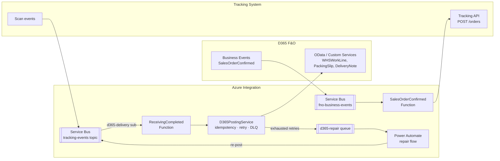

# D365 F&O Integration — Module 9

Event-driven integration between the tracking system and **Dynamics 365 Finance & Operations**. No polling — F&O **business events** push outbound; the tracking system's Service Bus topic pushes inbound.

## Architecture



## Flows

### Outbound (F&O → tracking) — `SalesOrderConfirmed`
F&O emits a business event when a sales order + warehouse work is confirmed. The function maps it (`Mapping.ToOrderIntake`) and calls the tracking API `POST /orders`, creating the `SalesOrder`, `OrderLine` and expected-`Carton` records (Module 1 schema). Idempotent on the F&O `EventId`.

### Inbound (tracking → F&O)
| Tracking event | F&O post |
|----------------|----------|
| `TrayBuildComplete` | Confirm picking work (`WHSWorkLine`) via custom service |
| `Loaded` + trip departure | Post ASN / shipment confirmation (packing slip) |
| `ReceivingComplete` | Post delivery note / packing slip; **shortages** → case *or* quantity adjustment (configurable) |

`ReceivingCompleted` (implemented here) routes through `D365PostingService`, which handles **idempotency, exponential-backoff retry (4 attempts), and dead-lettering**.

## Error handling

- **Retry** — exponential backoff inside `D365PostingService` (base 2s, ×2 per attempt).
- **Dead-letter** — after retries, the post is dead-lettered (`ServiceBusDeadLetterSink` → `d365-repair`); a **Power Automate repair flow** notifies the integration owner and offers one-click re-post.
- **Idempotency** — every post dedupes on the event id (`IIdempotencyStore`), so redelivery / repair re-posts never double-post.

## Code

| File | Role |
|------|------|
| `Integration/Models.cs` | F&O + tracking DTOs |
| `Integration/Mapping.cs` | Pure field mapping (see `mapping.md`) |
| `Integration/D365PostingService.cs` | Inbound posting: idempotency + retry + DLQ |
| `Functions/SalesOrderConfirmedFunction.cs` | Outbound flow (one) |
| `Functions/ReceivingCompletedFunction.cs` | Inbound flow (one) |
| `Functions/Clients.cs` | HTTP tracking-intake + OData F&O clients |

## Test

```bash
dotnet test          # 9 tests: mapping, shortage→case/adjustment, dedupe, retry, dead-letter
```

## Docs

- [`business-events.md`](business-events.md) — event contracts / JSON schemas
- [`mapping.md`](mapping.md) — field mapping table
- [`bc-appendix.md`](bc-appendix.md) — Business Central equivalent design
